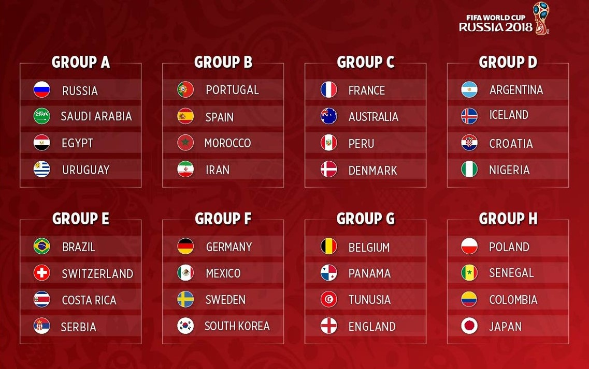

# **World cup dataminer**

## Descripción del problema
Este programa es un software cliente que obtiene información de un servidor de datos seleccionado, para este fin se estará empleando el protocolo HTTP. Los datos obtenidos del servidor servirán para mostrar la ruta de una selección determinada en el mundial de fútbol, empezando por sus resultados en fase de grupos y mostrando además, los resultados de sus juegos en etapas más avanzadas como octavos, cuartos, semifinal y final en el caso que dicha selección las halla disputado. La visualización de los datos se hará mediante la interfaz de consola, la cual será capaz de mostrar los resultados de los equipos que el usuario indique. Los datos a utilizar están basados en las estadísticas que dejó el mundial de fútbol de Rusia 2018.

<center>

  

</center>

## Manual de uso

El usuario podrá introducir el nombre del país del que desea saber sus estadísticas, el programa desplegará en la consola el recorrido de la selección en el mundial abarcando todas sus participaciones en fase de grupos y en instancias eliminatorias si aplicara. En el caso de que el equipo introducido no contara con particiáciones en el mundial, se desplegará un mensaje de error.

### Librerías

Para la realización de este proyecto fue necesario el uso de librerías de C++ externas, es necesario tenerlas instaladas para poder compilar exitosamente el código, las librerías utilizadas son las siguientes:

* OpenSSL
* nlohmann-json3-dev

Para instalar estas librerías utilice los siguientes comandos respectivamente:

```
sudo apt-get install openssl
sudo apt-get install nlohmann-json3-dev
```

### Compilación

Para compilar el código se utiliza el siguiente comando:
```
make
```
Este comando generará una carpeta ```bin``` en la cual se guardará el archivo ```WorldCup-DataMiner.o```
### Ejecución

Posterior a la compilación del código, para ejecutar el programa debe emplearse el siguiente comando:

```
bin/WorldCup-DataMiner
```
## Créditos

Proyecto desarrollado por:
* Michelle Fonseca Carrillo, correo: michelle.fonsecacarrillo@ucr.ac.cr
* Esteban Castañeda Blanco, correo: esteban.castaneda@ucr.ac.cr
* Daniel Lizano Morales, correo: daniel.lizanomorales@ucr.ac.cr
* Jorge Loría López, correo: jorge.lorialopez@ucr.ac.cr